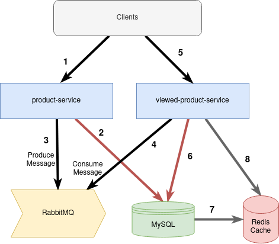

# Recently visited products 

Implementation of recently visited products using microservices 


## Table of contents
* [General info](#general-info)
* [Technologies](#technologies)
* [Components](#components)
* [Setup](#setup)
* [API RESTful URLs](#urls)
* [Test application](#testapp)

## General info
	
**Architecture diagram**


	
### Application flow

1.  Customer visits a product.

2.  Product service retrieves product from database.

3.  Put a message in the Queue with the customer ID and product ID consulted.

4.  Viewed product service consumes the message from the queue and save/update the database with the product visited by the customer.

5.  Client make a call to retrieve all recently visited products of a client.

6.  Viewed product service retrieves the list of recently visited products from the database.

7.  Once the list is fetched from the database it is cached by Redis.

8.  In the following calls from the client, if the list is in cache, then this is taken and the response is returned, otherwise it continues in flow 6. 	
	
	
	
## Technologies
* Java 11
* Spring boot v2.5.5
* Docker
* Docker compose
* Gradlew v7.2
* MySQL
* Redis
* RabbitMQ

## Components
1.  **product-service** 
      
    Microservice to manage products 

2.  **viewed-product-service** 
      
    Microservice to manage the products visited by customers. 

	
## Setup

Before to run the application is necessary have installed those tools in your computer:

* Install Docker Engine
<https://docs.docker.com/engine/install/>

* Install Docker Compose
<https://docs.docker.com/compose/install/>


To build the application go to folder of each project and execute the commands below, those will build first the component .jar and second the docker container
  
```
cd {path}/product-service  
./gradlew clean build
docker build -t product-service:1.0 .

cd {path}/viewed-product-service
./gradlew clean build
docker build -t viewed-product-service:1.0 .

```

  
Run application:
- **Option 1** : 
  
> 
Run using docker compose (recommended). You need to have installed Docker and Compose.
    
 ```
  cd {path-project}
  docker-compose up
```

- **Option 2:**  

     - Install MySQL locally
     	  create manually a user "root" with password "password" and a new database named "market"
     - Install RabbitMQ locally
     - Install Redis locally
     
    cd {path}/product-service
    ./gradlew bootRun
  
    cd {path}/viewed-product-service
    ./gradlew bootRun
 
 
* NOTE:
   The database schema and inserts data are in this route: 
   {Source Path}/viewed-product-service/src/main/resources 
 
  
## URLs

### API view-product-service

- Save product viewed
    
  POST: <http://localhost:9091/api/product/viewed>   
  Body example:  
  
```
    {
      "customerId" : 100,
      "productId": 36
    }
```
  
- Get product viewed    
GET: <http://localhost:9091/api/product/viewed/{customerId}> 
  
 
- Update product viewed    
PUT: <http://localhost:9091/api/product/viewed/{customerId}/{productId}> 
  

- Delete product viewed    
DELETE: <http://localhost:9091/api/product/viewed/{customerId}/{productId}> 
  


### API product-service

- Client visit a product - This endpoint emulates the flow step 1 behavior of the diagram when the customer visits a product and a message is sent to the queue. 
GET: <http://localhost:9090/product/{customerId}/{productId}>


### RabbitMQ

- RabbitMQ (user: guest, pwd: guest)   
<http://localhost:15672/>


## TestApp

The application already has 100 products preloaded ranging from 1 ... 100, as well as 10 clients from 1 ... 10. To test the application, just replace the clientId with any value between 1 ... 10 and the productId with values ​​between 1 ... 100.
As part of the request when the user does not have any visited products, a default list is returned that is obtained from the "product_most_viewed" table, ordered in descending order.

------------------------------------------------------------

&copy; Marco Hinojosa
<https://github.com/cylixx> 

